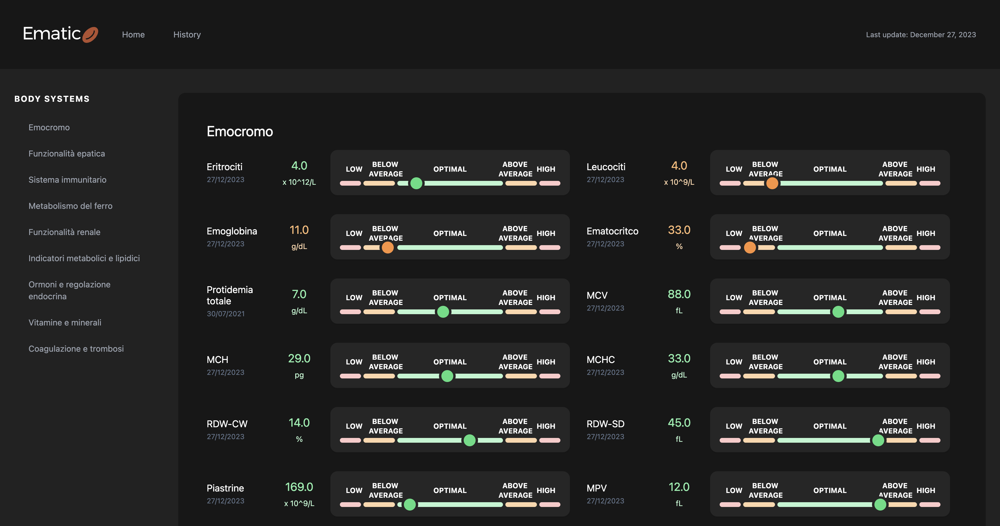

# 

Ematico is a web application for visualizing blood test results. It provides an interactive and user-friendly interface to explore and analyze blood test data. It is built with Plotly and Dash.

## Features

- **Interactive Visualization**: Visualize blood test results using interactive components.
- **Categorized Display**: Display blood test results categorized by different groups.
- **Responsive Design**: Ensure a seamless experience on various devices.

## Getting Started

Follow these instructions to get Ematico up and running on your local machine.

### Prerequisites

- Python 3.x
- [Dash](https://dash.plotly.com/)
- [Dash Bootstrap Components](https://dash-bootstrap-components.opensource.faculty.ai/)

### Installation

1. Clone the repository:

    ```bash
    git clone https://github.com/andreaiorio/ematico.git
    cd ematico
    ```

2. Install Poetry:

    Follow the instructions on the [Poetry Installation Page](https://python-poetry.org/docs/#installation) to install Poetry.

3. Install project dependencies:

    ```bash
    poetry install
    ```

   This will install the required dependencies specified in the `pyproject.toml` file, including both the main and development dependencies.

## Usage

1. Run the Ematico web application:

    ```bash
    poetry run python ematico/app.py -f path/to/your/excel/file.xlsx -p 8050
    ```

2. Open your web browser and navigate to `http://127.0.0.1:8050/` to view Ematico.

## Screenshot


## Contributing

If you would like to contribute to Ematico, please follow the guidelines in [CONTRIBUTING.md](CONTRIBUTING.md).

## License

This project is licensed under the MIT License - see the [LICENSE](LICENSE) file for details.

## Contact

For any questions or issues, please open an [issue](https://github.com/andreaiorio/ematico/issues).
